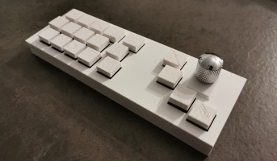

# Skewpad

100% homemade keyboard extension (electronic, PCB schema, code, 3D printing)

Plug&Play (no driver needed)

- [Skewpad tutorial & blog page](https://projets.corentinz.fr/skewpad)
- [Skewpad french IRL presentation (1h)](https://www.youtube.com/watch?v=O9gYMHVa9y0)

# What is it ?

It's a *keyboard*, *keypad*, *macropad*, *streamdeck*, wathever you want it to be. 
Accurately, it's a printed circuit board with switches you can use to do actions on your PC.

You are a *streamer*, *developer*, *graphist*, or just someone interested in having shortcuts outside your main keyboard ? 
This is **exactly for you**.

Just plug it and feel free to bind all keystrokes to your favorite software.

You are a geek and you want the same homemade stuff, by yourself ? You can do it !

Here on Github you have the code and all the assets (PCB, 3D Stl). But actually the more important for me was the process : 😉 
Check out the blog page or the presentation to understand it all !

# Assets

Speaking of recreate it, all I created is free and available !

You have :
- [The code, ready to compile (Arduino)](https://github.com/Skewnart/Skewpad/blob/main/skewpad.ino)
- [PCB files, ready to print](https://github.com/Skewnart/Skewpad/blob/main/repo_assets/Gerber_PCB_SkewPadv1.zip)
- [All case parts, ready to 3D print](https://github.com/Skewnart/Skewpad/tree/main/repo_assets/case)
